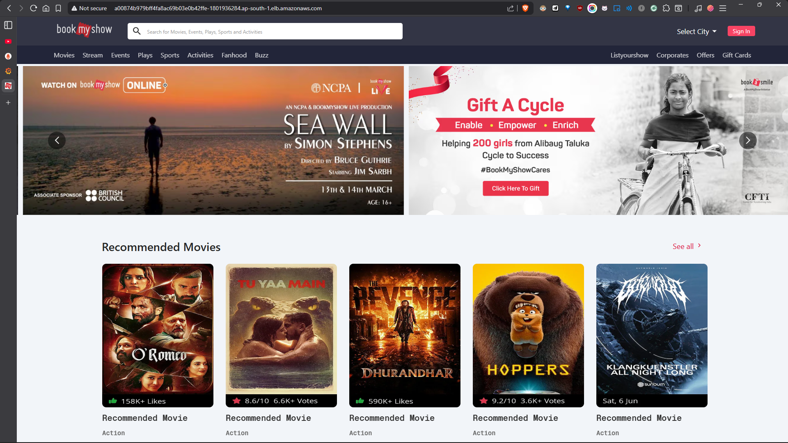

# 🚀 Book My Show App - DevSecOps Deployment

The **Book My Show App** is a comprehensive clone application showcasing a seamless ticket-booking experience. More importantly, this repository serves as a masterclass in modern **DevSecOps** practices, demonstrating an end-to-end continuous integration and deployment pipeline across containerized and orchestrated environments. Built on a React frontend, the project brings together the industry’s leading tools to guarantee secure, highly available, and observable application delivery.

## Key Features

- **Robust React Frontend**: A performant and responsive user interface built using React and Vite.
- **Dual Deployment Strategies**: Supports both standalone Docker container deployment (Staging) and Amazon EKS (Kubernetes) orchestration (Production).
- **Integrated Security Scanning**: Embeds SonarQube for code quality, OWASP Dependency Check for vulnerabilities, and Trivy for filesystem and container image scanning.
- **Comprehensive Monitoring**: Independent EC2 infrastructure tracking system health via Node Exporter and application metrics through Prometheus and Grafana dashboards.
- **Automated CI/CD Pipelines**: Fully automated Jenkins pipelines taking code from repository to production with minimal human intervention.

---

## 🛠️ Tech Stack

- **Frontend**: React (v17.0.1) built with Vite
- **Package Manager**: npm
- **Containerization**: Docker & Docker Hub
- **Orchestration**: Kubernetes (Amazon EKS)
- **CI/CD Pipeline**: Jenkins
- **Code Quality & Security**: SonarQube, OWASP Dependency-Check, Trivy
- **Cloud Provider**: Amazon Web Services (EC2 for hosting Jenkins/Prometheus, EKS for workloads)
- **Monitoring & Observability**: Prometheus, Grafana, Node Exporter

---

## 🔧 Prerequisites

To set up and work with this project locally or configure your own deployment infrastructure, you need:

- **Node.js** (v18 or higher) and npm (for local frontend development)
- **Docker** and **Docker Compose**
- An **AWS Account** with permissions to provision EC2 instances, IAM roles, and EKS clusters
- **AWS CLI** configured on your local machine
- **kubectl** and **eksctl** installed for Kubernetes cluster management

---


---

## 🛠️ **Tools & Services Used**

| **Category**         | **Tools**                                                                                                                                                                                                              |
| -------------------- | ---------------------------------------------------------------------------------------------------------------------------------------------------------------------------------------------------------------------- |
| **Version Control**  |                                                                                                                     |
| **CI/CD**            |                                                                                                                  |
| **Code Quality**     |                                                                                                            |
| **Security**         |                        |
| **Containerization** |                                                                                                                     |
| **Orchestration**    |                                                                                                         |
| **Monitoring**       |   |

---

## 🚀 Getting Started

### 1. Clone the Repository

```bash
git clone https://github.com/Pratik543/bookmyshow.git
cd bookmyshow
```

### 2. Local Front-End Development

The application resides in the `bookmyshow-app` directory.

```bash
cd bookmyshow-app

# Install dependencies
npm ci

# Start the Vite development server
npm run start
```

Open [http://localhost:5173](http://localhost:5173) in your browser.

### 3. Local Docker Build

To run the application locally within a Docker container (simulating the staging environment):

```bash
# From the root directory
docker build -t bms-app:latest -f bookmyshow-app/Dockerfile bookmyshow-app

# Run the container
docker run -p 8080:80 bms-app:latest
```

The app will be served via Nginx on [http://localhost:8080](http://localhost:8080).

---

## 🏗️ Architecture

### Directory Structure

```text
├── bookmyshow-app/        # React Application source
│   ├── src/               # React components, pages, context, and styles
│   ├── public/            # Static assets
│   ├── package.json       # Node dependencies and scripts
│   ├── vite.config.js     # Vite bundler configuration
│   └── Dockerfile         # Multi-stage Dockerfile (Node builder -> Nginx server)
├── k8s/                   # Kubernetes manifests
│   ├── deployment.yml     # EKS Deployment configuration
│   └── service.yml        # EKS Service configuration (LoadBalancer/NodePort)
├── Jenkinsfile1           # Pipeline for Docker Container Deployment (Staging)
├── Jenkinsfile2           # Pipeline for Amazon EKS Deployment (Production)
└── Documentation.md       # Step-by-step infrastructure setup guide
```

### Deployment Architecture & Workflow

1. **VCS Trigger**: Code pushed to GitHub triggers the Jenkins webhook.
2. **Quality & Security Pipeline**:
   - Source code is checked out on the Jenkins EC2 agent.
   - **SonarQube** performs static application security testing (SAST) and code quality analysis.
   - **OWASP Dependency-Check** scans the Node.js packages for vulnerabilities.
   - **Trivy** scans the filesystem.
3. **Build & Push**:
   - Docker builds the image using a two-stage process (compressing the final image using Nginx Alpine).
   - The compiled image is pushed to Docker Hub (`c0dechamp/bms-app:latest`).
4. **Deployment Options**:
   - **Staging (Jenkinsfile1)**: Deploys the built image directly to a Docker container running on the Jenkins host.
   - **Production (Jenkinsfile2)**: authenticates with AWS via `aws eks update-kubeconfig` and uses `kubectl` to apply the manifests in the `k8s/` directory to the EKS cluster.
5. **Observability**: A separate EC2 instance runs **Prometheus** (scraping Jenkins and Node Exporter endpoints) and **Grafana** for real-time visualization.

---

## 💻 Available Scripts (bookmyshow-app)

| Command         | Description                                     |
| --------------- | ----------------------------------------------- |
| `npm run start` | Starts the Vite development server.             |
| `npm run build` | Compiles and minifies the React app for prod.   |
| `npm run serve` | Previews the production build locally via Vite. |

---

## 🚢 Deployment Infrastructure Setup

The full, step-by-step configuration for the AWS infrastructure is documented in [Documentation.md](./Documentation.md). Below is a high-level summary of the setup:

### Phase 1: Jenkins Server Setup (EC2)
1. Provision an Ubuntu EC2 instance.
2. Install **Java 21**, **Jenkins**, **Docker**, and **Trivy**.
3. Install **AWS CLI**, **kubectl**, and **eksctl**.
4. Run a **SonarQube** container for local code scanning.
5. Provide the EC2 instance an IAM Role with permissions for EKS, EC2, CloudFormation, and IAM pass-roles.

### Phase 2: EKS Cluster Provisioning
Using `eksctl`, stand up the Kubernetes cluster to act as the production environment:
```bash
eksctl create cluster --name bmsEks --region ap-south-1 --zones ap-south-1a,ap-south-1b --version 1.35 --without-nodegroup
eksctl utils associate-iam-oidc-provider --region ap-south-1 --cluster bmsEks --approve
eksctl create nodegroup --cluster bmsEks --region ap-south-1 --name bmsNodes --node-type c7i-flex.large --nodes 3 --managed --asg-access
```

### Phase 3: Observability Server Setup (EC2)
1. Provision a secondary EC2 instance for metrics collection.
2. Install and configure **Prometheus** as a systemd service.
3. Install **Node Exporter** to expose hardware and OS metrics.
4. Install **Grafana** and connect Prometheus as the primary data source. Import dashboards (e.g., ID: 1860 for Node Exporter, 9964 for Jenkins metrics).

---

## 🧪 Security & Quality Testing

This project employs a robust security gate mechanism within the pipelines:
- **SonarQube Scanner**: Enforces clean code principles.
- **OWASP**: `--disableYarnAudit --disableNodeAudit` arguments are utilized alongside the `dependency-check` plugin to isolate the vulnerability checks against CVEs.
- **Trivy FS Scan**: `trivy fs . > trivyfs.txt` executes a filesystem scan. The results are automatically attached to the Post-build email extension in Jenkins.

---

## ⚙️ Troubleshooting

### Vite React App Fails to Start
**Error**: `vite: not found` or similar.
**Solution**: Ensure dependencies are installed cleanly by running `rm -rf node_modules package-lock.json && npm install`.

### EKS Deployment Authorization Failure
**Error**: Jenkins console throws unauthorized errors when executing `kubectl apply`.
**Solution**: Ensure the Jenkins AWS IAM user/role matches the identity that created the EKS cluster, or that the `aws-auth` ConfigMap authorizes the Jenkins role to manage the cluster. Test the configuration manually via `sudo -u jenkins aws sts get-caller-identity`.

### Jenkins Post-Build Email Action Fails
**Error**: `AuthenticationFailedException` when sending emails.
**Solution**: Google requires "App Passwords" for SMTP if 2FA is enabled. Generate an App Password from your Google Account settings, and use that within the Jenkins `email-creds` authentication block alongside `smtp.gmail.com` on port `465` (SSL checked).

## 🚦 **Project Stages**

### **Phase 1: Deployment to Docker Container**
- Containerize the application using Docker.
- Build and push Docker images to a container registry.
- Run the application in a Docker container.

### **Phase 2: Deployment to EKS Cluster with Monitoring**
- Deploy the application to an **Amazon EKS (Elastic Kubernetes Service)** cluster.
- Set up **Prometheus** and **Grafana** for monitoring and visualization.
- Implement **Trivy** for vulnerability scanning and **OWASP** for security best practices.


## 🤝 **Connect with Me**

Let's connect and discuss DevOps!  

[](https://www.linkedin.com/in/pratik-k-gupta/)  

---